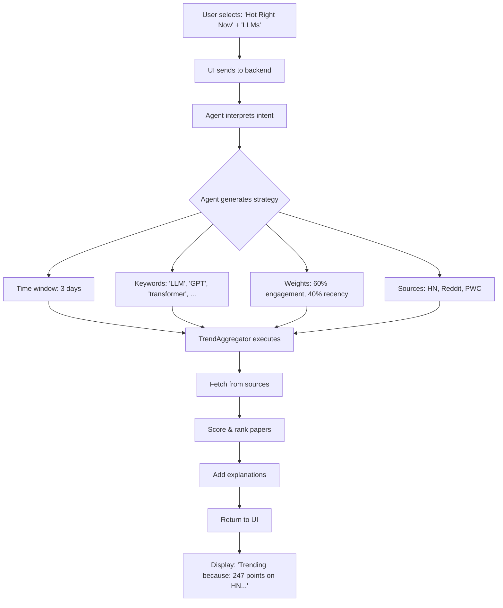

# Trend Discovery UI & Agent Configuration Design

## Philosophy

**Agent-First Design**: The agent is the intelligence - the UI provides minimal, high-level intent signals. The agent interprets these signals and makes intelligent decisions about search strategy, source weighting, and ranking.

**Minimal Configuration**: 3-5 simple controls, not a complex form. Users shouldn't need to understand the underlying architecture.

---

## UI Configuration Inputs (Minimal Set)

### 1. **Discovery Focus** (Primary Input)
What type of trends are you looking for?

**UI Control**: Segmented control / Radio buttons

```tsx
<DiscoveryFocusSelector>
  🔥 Hot Right Now      // Last 3 days, high engagement
  📈 Emerging Trends     // Last 2 weeks, velocity-focused
  💎 Hidden Gems         // Moderate engagement, niche topics
  🎯 Deep Dives          // Any timeframe, comprehensive discussions
</DiscoveryFocusSelector>
```

**Agent Interpretation**:
| Focus | Time Window | Scoring Weights | Min Engagement | Max Results |
|-------|-------------|-----------------|----------------|-------------|
| Hot Right Now | 3 days | 60% Engagement, 40% Recency | High (50+) | 10 |
| Emerging Trends | 14 days | 40% Engagement, 40% Velocity, 20% Recency | Medium (20+) | 20 |
| Hidden Gems | 30 days | 30% Engagement, 30% Authority, 40% Uniqueness | Low (5+) | 30 |
| Deep Dives | 90 days | 50% Authority, 30% Discussion Depth, 20% Citations | Medium (10+) | 15 |

### 2. **Topic Area** (Optional Filter)
What field are you interested in?

**UI Control**: Multi-select chips (max 3)

```tsx
<TopicSelector>
  🤖 LLMs & Language Models
  🎨 Generative AI & Diffusion
  🧠 Agents & Reasoning
  👁️ Computer Vision
  🔬 Interpretability & Safety
  🛠️ Tools & Applications
  🌐 Multimodal Models
  ⚡ Efficiency & Optimization
  📊 Benchmarks & Evaluation
  💡 Other
</TopicSelector>
```

**Agent Interpretation**:
- Generate topic-specific search terms
- Weight sources by topic relevance (e.g., r/LocalLLaMA for LLMs)
- Filter results by keyword matching
- Boost papers from topic-specific authors/labs

**Examples**:
```python
# User selects: "LLMs & Language Models"
agent_generated_keywords = [
    "large language model", "LLM", "GPT", "transformer",
    "in-context learning", "prompting", "instruction tuning"
]

# User selects: "Agents & Reasoning"
agent_generated_keywords = [
    "agent", "reasoning", "planning", "tool use",
    "chain of thought", "ReAct", "autonomous"
]
```

### 3. **Community Perspective** (Optional)
Whose opinions do you value?

**UI Control**: Checkbox group (multi-select)

```tsx
<CommunitySelector>
  ✓ Researchers (HackerNews, Papers with Code)
  ✓ Practitioners (Reddit r/MachineLearning, r/LocalLLaMA)
  ✓ Builders (GitHub trending, Hugging Face)
  ✓ Twitter/X (requires premium - future)
</CommunitySelector>
```

**Agent Interpretation**:
- Enable/disable specific sources
- Weight sources by user preference
- Adjust authority scoring based on community

**Default**: All free sources enabled

### 4. **Recency Slider** (Advanced - Collapsible)
How recent should results be?

**UI Control**: Slider (hidden by default)

```tsx
<RecencySlider>
  [Past 24h] ──●────────────── [Past 6 months]
               ↑
           Default: 1 week
</RecencySlider>
```

**Agent Interpretation**:
- Adjusts time window for all sources
- Modifies recency weight in scoring
- Shows/hides older papers

### 5. **Search Query** (Optional - Smart Override)
Specific keywords or paper ID?

**UI Control**: Search input with smart detection

```tsx
<SearchInput
  placeholder="Optional: 'attention mechanisms' or arxiv ID"
  smartDetection={true}
/>
```

**Agent Interpretation**:
```python
if is_arxiv_id(query):
    # Direct lookup + find discussions
    return find_discussions_for_paper(query)
elif has_keywords(query):
    # Combine with trend discovery
    return filter_trending_by_keywords(query)
else:
    # Pure trend discovery (ignore query)
    return discover_trending()
```

---

## UI Layout & Flow

### Discovery Page Layout

```
┌─────────────────────────────────────────────────────────┐
│  📊 Discover Trending Papers                            │
├─────────────────────────────────────────────────────────┤
│                                                          │
│  What type of trends are you looking for?               │
│  ┌──────┐ ┌──────┐ ┌──────┐ ┌──────┐                  │
│  │ 🔥   │ │ 📈   │ │ 💎   │ │ 🎯   │                  │
│  │ Hot  │ │Emerg.│ │Hidden│ │ Deep │   ← Default: Hot │
│  └──●───┘ └──────┘ └──────┘ └──────┘                  │
│                                                          │
│  ▼ Advanced Options                                     │
│  ┌────────────────────────────────────────────────┐    │
│  │ Topic Areas (optional):                         │    │
│  │  [🤖 LLMs] [🎨 GenAI] [🧠 Agents]              │    │
│  │                                                  │    │
│  │ Community Perspectives:                          │    │
│  │  ☑ Researchers  ☑ Practitioners  ☑ Builders    │    │
│  │                                                  │    │
│  │ Recency: [Past 24h] ──●────── [6 months]       │    │
│  └────────────────────────────────────────────────┘    │
│                                                          │
│  [🔍 Discover Trending Papers]                          │
│                                                          │
└─────────────────────────────────────────────────────────┘

┌─────────────────────────────────────────────────────────┐
│  📈 Results (23 trending papers)                         │
├─────────────────────────────────────────────────────────┤
│                                                          │
│  1. Constitutional AI: Harmlessness from AI Feedback    │
│     [2401.12345] • 87.5 trend score • 🔥 Trending       │
│     ├─ 247 upvotes on HN • 156 comments                 │
│     ├─ 89 upvotes on r/MachineLearning                  │
│     └─ "This is groundbreaking for alignment..."        │
│     [💬 View Discussions] [📄 Read Paper] [🔖 Save]     │
│                                                          │
│  2. Efficient Streaming LLMs with Attention Sinks       │
│     [2309.17453] • 82.3 trend score • 📈 Rising         │
│     └─ 198 points on HN • 73 comments                   │
│     [💬 View Discussions] [📄 Read Paper] [🔖 Save]     │
│                                                          │
└─────────────────────────────────────────────────────────┘
```

---

## Agent State & Intelligence

### Agent State Structure

```python
class TrendDiscoveryState:
    """State for the trend discovery agent node."""

    # User inputs (from UI)
    discovery_focus: str = "hot"  # "hot", "emerging", "hidden", "deep"
    topic_areas: List[str] = []   # ["llm", "genai", "agents"]
    communities: List[str] = ["researchers", "practitioners", "builders"]
    recency_days: int = 7
    search_query: Optional[str] = None

    # Agent-generated
    search_strategy: dict = {}
    source_weights: dict = {}
    scoring_weights: dict = {}
    generated_keywords: List[str] = []

    # Results
    trending_papers: List[TrendingPaper] = []
    metadata: dict = {}
```

### Agent Intelligence Layer

The agent interprets minimal user inputs and generates detailed search strategy:

```python
class TrendDiscoveryAgent:
    """Intelligent agent that interprets user intent and discovers trends."""

    async def execute(self, state: TrendDiscoveryState) -> TrendDiscoveryState:
        """
        1. Interpret user inputs
        2. Generate search strategy
        3. Execute multi-source discovery
        4. Rank and filter results
        5. Return with explanations
        """

        # Step 1: Interpret discovery focus
        state = self._interpret_focus(state)

        # Step 2: Generate topic keywords
        if state.topic_areas:
            state = await self._generate_topic_keywords(state)

        # Step 3: Configure sources
        state = self._configure_sources(state)

        # Step 4: Execute discovery
        state = await self._discover_trending(state)

        # Step 5: Post-process and explain
        state = self._add_explanations(state)

        return state

    def _interpret_focus(self, state: TrendDiscoveryState) -> TrendDiscoveryState:
        """Translate discovery focus into concrete parameters."""

        focus_config = {
            "hot": {
                "time_window_hours": 72,  # 3 days
                "scoring_weights": {
                    "engagement": 0.6,
                    "recency": 0.4,
                    "authority": 0.0,
                    "velocity": 0.0,
                },
                "min_engagement": 50,
                "max_results": 10,
                "sort_by": "trend_score",
                "description": "Papers with high engagement in the last 3 days"
            },
            "emerging": {
                "time_window_hours": 336,  # 14 days
                "scoring_weights": {
                    "engagement": 0.3,
                    "recency": 0.3,
                    "authority": 0.1,
                    "velocity": 0.3,  # Key: rapid growth
                },
                "min_engagement": 20,
                "max_results": 20,
                "sort_by": "buzz_velocity",
                "description": "Papers gaining traction quickly"
            },
            "hidden": {
                "time_window_hours": 720,  # 30 days
                "scoring_weights": {
                    "engagement": 0.2,
                    "recency": 0.1,
                    "authority": 0.4,
                    "uniqueness": 0.3,  # Novel: fewer mentions but high quality
                },
                "min_engagement": 5,
                "max_results": 30,
                "sort_by": "authority_score",
                "description": "Quality papers that haven't gone viral"
            },
            "deep": {
                "time_window_hours": 2160,  # 90 days
                "scoring_weights": {
                    "engagement": 0.2,
                    "recency": 0.0,
                    "authority": 0.5,
                    "discussion_depth": 0.3,  # Long, thoughtful discussions
                },
                "min_engagement": 10,
                "max_results": 15,
                "sort_by": "discussion_quality",
                "description": "Papers with in-depth expert discussions"
            }
        }

        config = focus_config[state.discovery_focus]
        state.search_strategy = config

        # Override time window if user specified recency
        if state.recency_days != 7:
            state.search_strategy["time_window_hours"] = state.recency_days * 24

        return state

    async def _generate_topic_keywords(self, state: TrendDiscoveryState) -> TrendDiscoveryState:
        """Use LLM to generate smart keywords from topic areas."""

        topic_keyword_map = {
            "llm": [
                "large language model", "LLM", "GPT", "transformer",
                "in-context learning", "prompt", "instruction tuning",
                "RLHF", "alignment", "fine-tuning"
            ],
            "genai": [
                "generative", "diffusion", "GAN", "VAE",
                "text-to-image", "stable diffusion", "DALL-E",
                "generation", "synthesis"
            ],
            "agents": [
                "agent", "autonomous", "reasoning", "planning",
                "tool use", "ReAct", "chain of thought",
                "multi-agent", "LLM agent"
            ],
            "vision": [
                "computer vision", "image", "video", "segmentation",
                "detection", "ViT", "CLIP", "multimodal"
            ],
            "safety": [
                "interpretability", "explainability", "safety",
                "alignment", "robustness", "adversarial",
                "bias", "fairness", "ethical"
            ],
            "efficiency": [
                "efficient", "optimization", "quantization",
                "pruning", "distillation", "compression",
                "low-resource", "edge", "mobile"
            ],
        }

        # Expand user topics into keywords
        keywords = []
        for topic in state.topic_areas:
            keywords.extend(topic_keyword_map.get(topic, [topic]))

        state.generated_keywords = list(set(keywords))  # Deduplicate

        return state

    def _configure_sources(self, state: TrendDiscoveryState) -> TrendDiscoveryState:
        """Weight sources based on community preferences and topic."""

        # Base source weights
        source_weights = {
            "hackernews": 1.0,
            "reddit": 1.0,
            "paperswithcode": 1.0,
            "huggingface": 1.0,
        }

        # Adjust based on selected communities
        if "researchers" not in state.communities:
            source_weights["hackernews"] *= 0.5
            source_weights["paperswithcode"] *= 0.5

        if "practitioners" not in state.communities:
            source_weights["reddit"] *= 0.3

        if "builders" not in state.communities:
            source_weights["huggingface"] *= 0.3

        # Topic-specific source boosting
        if "llm" in state.topic_areas or "genai" in state.topic_areas:
            source_weights["reddit"] *= 1.5  # r/LocalLLaMA, r/StableDiffusion
            source_weights["huggingface"] *= 1.5

        if "agents" in state.topic_areas:
            source_weights["hackernews"] *= 1.3  # Good agent discussions

        state.source_weights = source_weights

        return state

    async def _discover_trending(self, state: TrendDiscoveryState) -> TrendDiscoveryState:
        """Execute trend discovery with configured strategy."""

        # Initialize sources based on weights
        sources = []
        if state.source_weights.get("hackernews", 0) > 0:
            sources.append(HackerNewsSource())
        if state.source_weights.get("reddit", 0) > 0:
            sources.append(RedditSource())
        # ... etc

        # Create aggregator
        aggregator = TrendAggregator(sources=sources)

        # Discover with strategy
        trending_papers = await aggregator.discover_trending_papers(
            topic=" ".join(state.generated_keywords) if state.generated_keywords else "AI",
            time_window_hours=state.search_strategy["time_window_hours"],
            max_results=state.search_strategy["max_results"],
            scoring_weights=state.search_strategy["scoring_weights"],
            source_weights=state.source_weights,
        )

        # Filter by minimum engagement
        min_engagement = state.search_strategy.get("min_engagement", 0)
        trending_papers = [
            p for p in trending_papers
            if p.total_engagement >= min_engagement
        ]

        state.trending_papers = trending_papers

        return state

    def _add_explanations(self, state: TrendDiscoveryState) -> TrendDiscoveryState:
        """Add human-readable explanations for why papers are trending."""

        for paper in state.trending_papers:
            reasons = []

            # Engagement reason
            if paper.total_mentions > 5:
                reasons.append(f"Discussed in {paper.total_mentions} places")
            if paper.total_engagement > 200:
                reasons.append(f"{paper.total_engagement} total interactions")

            # Velocity reason
            if paper.buzz_velocity > 2:
                reasons.append(f"Rapidly trending ({paper.buzz_velocity:.1f} mentions/day)")

            # Source-specific reasons
            source_reasons = []
            for signal in paper.signals:
                if signal.source == "hackernews" and signal.upvotes > 100:
                    source_reasons.append(f"{signal.upvotes} points on HN")
                if signal.source == "reddit" and signal.upvotes > 50:
                    source_reasons.append(f"{signal.upvotes} upvotes on Reddit")

            reasons.extend(source_reasons[:2])  # Top 2 source reasons

            paper.metadata["trending_reasons"] = reasons

        return state
```

---

## Frontend Components

### 1. DiscoveryFocusSelector Component

```tsx
// apps/web/src/components/TrendDiscovery/DiscoveryFocusSelector.tsx

import { useState } from 'react';
import styles from './DiscoveryFocusSelector.module.css';

type FocusType = 'hot' | 'emerging' | 'hidden' | 'deep';

interface FocusOption {
  value: FocusType;
  icon: string;
  label: string;
  description: string;
}

const FOCUS_OPTIONS: FocusOption[] = [
  {
    value: 'hot',
    icon: '🔥',
    label: 'Hot Right Now',
    description: 'Papers with high engagement in the last 3 days'
  },
  {
    value: 'emerging',
    icon: '📈',
    label: 'Emerging Trends',
    description: 'Papers gaining traction quickly'
  },
  {
    value: 'hidden',
    icon: '💎',
    label: 'Hidden Gems',
    description: 'Quality papers that haven\'t gone viral'
  },
  {
    value: 'deep',
    icon: '🎯',
    label: 'Deep Dives',
    description: 'Papers with in-depth expert discussions'
  }
];

export function DiscoveryFocusSelector({
  value,
  onChange
}: {
  value: FocusType;
  onChange: (focus: FocusType) => void;
}) {
  const [hoveredOption, setHoveredOption] = useState<FocusType | null>(null);

  return (
    <div className={styles.container}>
      <label className={styles.label}>
        What type of trends are you looking for?
      </label>

      <div className={styles.options}>
        {FOCUS_OPTIONS.map(option => (
          <button
            key={option.value}
            className={`${styles.option} ${value === option.value ? styles.selected : ''}`}
            onClick={() => onChange(option.value)}
            onMouseEnter={() => setHoveredOption(option.value)}
            onMouseLeave={() => setHoveredOption(null)}
          >
            <div className={styles.icon}>{option.icon}</div>
            <div className={styles.optionLabel}>{option.label}</div>
          </button>
        ))}
      </div>

      {/* Show description on hover or selection */}
      <div className={styles.description}>
        {FOCUS_OPTIONS.find(o => o.value === (hoveredOption || value))?.description}
      </div>
    </div>
  );
}
```

### 2. TopicSelector Component

```tsx
// apps/web/src/components/TrendDiscovery/TopicSelector.tsx

import { useState } from 'react';
import styles from './TopicSelector.module.css';

interface Topic {
  id: string;
  icon: string;
  label: string;
}

const TOPICS: Topic[] = [
  { id: 'llm', icon: '🤖', label: 'LLMs & Language Models' },
  { id: 'genai', icon: '🎨', label: 'Generative AI & Diffusion' },
  { id: 'agents', icon: '🧠', label: 'Agents & Reasoning' },
  { id: 'vision', icon: '👁️', label: 'Computer Vision' },
  { id: 'safety', icon: '🔬', label: 'Interpretability & Safety' },
  { id: 'efficiency', icon: '⚡', label: 'Efficiency & Optimization' },
];

export function TopicSelector({
  selected,
  onChange
}: {
  selected: string[];
  onChange: (topics: string[]) => void;
}) {
  const MAX_SELECTION = 3;

  const toggleTopic = (topicId: string) => {
    if (selected.includes(topicId)) {
      onChange(selected.filter(t => t !== topicId));
    } else if (selected.length < MAX_SELECTION) {
      onChange([...selected, topicId]);
    }
  };

  return (
    <div className={styles.container}>
      <label className={styles.label}>
        Topic Areas <span className={styles.optional}>(optional, max {MAX_SELECTION})</span>
      </label>

      <div className={styles.chips}>
        {TOPICS.map(topic => (
          <button
            key={topic.id}
            className={`${styles.chip} ${selected.includes(topic.id) ? styles.selected : ''}`}
            onClick={() => toggleTopic(topic.id)}
            disabled={!selected.includes(topic.id) && selected.length >= MAX_SELECTION}
          >
            <span className={styles.chipIcon}>{topic.icon}</span>
            <span className={styles.chipLabel}>{topic.label}</span>
            {selected.includes(topic.id) && (
              <span className={styles.checkmark}>✓</span>
            )}
          </button>
        ))}
      </div>

      {selected.length >= MAX_SELECTION && (
        <p className={styles.hint}>
          Max {MAX_SELECTION} topics selected. Deselect one to choose another.
        </p>
      )}
    </div>
  );
}
```

### 3. Main Discovery Page

```tsx
// apps/web/src/app/discover-trends/page.tsx

'use client';

import { useState } from 'react';
import { DiscoveryFocusSelector } from '@/components/TrendDiscovery/DiscoveryFocusSelector';
import { TopicSelector } from '@/components/TrendDiscovery/TopicSelector';
import { TrendingPaperCard } from '@/components/TrendDiscovery/TrendingPaperCard';
import type { TrendingPaper } from '@scribe/types';

type FocusType = 'hot' | 'emerging' | 'hidden' | 'deep';

export default function DiscoverTrendsPage() {
  // Simple state management
  const [focus, setFocus] = useState<FocusType>('hot');
  const [topics, setTopics] = useState<string[]>([]);
  const [communities, setCommunities] = useState(['researchers', 'practitioners', 'builders']);
  const [showAdvanced, setShowAdvanced] = useState(false);

  const [papers, setPapers] = useState<TrendingPaper[]>([]);
  const [loading, setLoading] = useState(false);

  const handleDiscover = async () => {
    setLoading(true);

    try {
      const response = await fetch('/api/v1/trends/discover', {
        method: 'POST',
        headers: { 'Content-Type': 'application/json' },
        body: JSON.stringify({
          discovery_focus: focus,
          topic_areas: topics,
          communities: communities,
        })
      });

      const data = await response.json();
      setPapers(data.papers);
    } catch (error) {
      console.error('Error discovering trends:', error);
    } finally {
      setLoading(false);
    }
  };

  return (
    <div className="container">
      <h1>📊 Discover Trending Papers</h1>
      <p className="subtitle">
        Find papers getting buzz in the AI community based on discussions across HackerNews, Reddit, and more.
      </p>

      {/* Primary Control */}
      <DiscoveryFocusSelector value={focus} onChange={setFocus} />

      {/* Advanced Options (Collapsible) */}
      <button
        className="advancedToggle"
        onClick={() => setShowAdvanced(!showAdvanced)}
      >
        {showAdvanced ? '▼' : '▶'} Advanced Options
      </button>

      {showAdvanced && (
        <div className="advancedOptions">
          <TopicSelector selected={topics} onChange={setTopics} />

          {/* Community selector, recency slider, etc. */}
        </div>
      )}

      {/* Discover Button */}
      <button
        className="discoverButton"
        onClick={handleDiscover}
        disabled={loading}
      >
        {loading ? 'Discovering...' : '🔍 Discover Trending Papers'}
      </button>

      {/* Results */}
      {papers.length > 0 && (
        <div className="results">
          <h2>📈 {papers.length} Trending Papers</h2>
          {papers.map(paper => (
            <TrendingPaperCard key={paper.id} paper={paper} />
          ))}
        </div>
      )}
    </div>
  );
}
```

---

## Agent-UI Coordination Flow



---

## API Updates

### New Endpoint: POST /api/v1/trends/discover

**Request**:
```json
{
  "discovery_focus": "hot",
  "topic_areas": ["llm", "agents"],
  "communities": ["researchers", "practitioners"],
  "recency_days": 7
}
```

**Response**:
```json
{
  "papers": [
    {
      "id": "2401.12345",
      "title": "Constitutional AI...",
      "trend_score": 87.5,
      "trending_reasons": [
        "Discussed in 3 places",
        "247 points on HN",
        "Rapidly trending (2.3 mentions/day)"
      ],
      "discussion_urls": [...],
      "...": "..."
    }
  ],
  "metadata": {
    "strategy_used": {
      "focus": "hot",
      "time_window_hours": 72,
      "generated_keywords": ["LLM", "GPT", "transformer", "agent", "reasoning"],
      "sources_queried": ["hackernews", "reddit"],
      "scoring_weights": {
        "engagement": 0.6,
        "recency": 0.4
      }
    }
  }
}
```

---

## Default Behavior (Zero Configuration)

If user just clicks "Discover" without any configuration:

```python
default_state = TrendDiscoveryState(
    discovery_focus="hot",          # Show what's hot right now
    topic_areas=[],                 # All AI topics
    communities=["researchers", "practitioners", "builders"],  # All sources
    recency_days=7,                 # Past week
    search_query=None               # No specific query
)
```

Agent automatically:
- Uses 3-day time window
- Searches all AI keywords
- Weights by engagement + recency
- Returns top 10 papers

**Zero friction, maximum value.**

---

## Summary: UI Design Principles

### ✅ What We Did Right

1. **Minimal Inputs**: 1 required (focus), 4 optional
2. **Agent Intelligence**: Agent interprets intent, not user configuration
3. **Progressive Disclosure**: Advanced options hidden by default
4. **Smart Defaults**: Works great with zero configuration
5. **Explainability**: Results show WHY papers are trending

### 🎯 Key Innovations

1. **Discovery Focus**: Novel way to express intent without complex filters
2. **Topic Expansion**: User picks "LLMs", agent generates 10+ relevant keywords
3. **Community Weighting**: Simple checkboxes map to complex source weighting
4. **Trend Explanations**: Papers come with human-readable reasons

### 📊 Information Architecture

```
Primary Controls (Always Visible):
└─ Discovery Focus (required)

Secondary Controls (Collapsible):
├─ Topic Areas (optional)
├─ Community Perspectives (optional)
└─ Recency Slider (advanced)

Tertiary Controls (Power Users):
└─ Direct search query override
```

---

## Next Steps

1. ✅ Review this UI design - Does it align with your vision?
2. Create UI components in `apps/web/src/components/TrendDiscovery/`
3. Update agent to interpret these inputs
4. Test user flows
5. Iterate based on feedback

**Philosophy**: The UI should feel like having a conversation with a smart research assistant, not filling out a form.

Does this align with your vision for the feature? Should I adjust anything?
